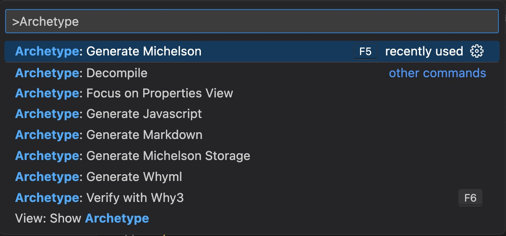

# "my first Tezos smart contract with Archetype - Mac edition"

This short tutorial shows how to install the development tools and write a minimal Tezos smart contract with Archetype. You need a Mac (tested on an Intel MacBook Pro) and some patience during the installation steps.

- Start from scratch, no previous knowledge necessary 
- Learn to develop a minimal Tezos smart contract 
- Write code in Archetype (https://archetype-lang.org/)
- Run the smart contract on a testnet (copy of the actual blockchain, no risk of value loss)

For an overview of Tezos developer resources see https://github.com/crcdng/tezos-dev-resources

## i. Install

### Install general development tools 

1. Download and install the [Visual Studio Code code editor](https://code.visualstudio.com/)

2. Install the [Homebrew](https://brew.sh/) tooling environment: open a Terminal (press command-Spacebar and type "terminal"), then execute this command in the Terminal 

`/bin/bash -c "$(curl -fsSL https://raw.githubusercontent.com/Homebrew/install/HEAD/install.sh)"`

If you do not already have Apple's XCode installed, make sure that you confirm when the installations prompts you with "The XCode Command Line Tools will be installed." Alternatively, you can also get XCode from the Apple App Store.

3. Install [node.js / npm](https://nodejs.org/) with Homebrew

In the Terminal, execute this command:  

`brew install node`

Close and re-open the Terminal.  

### Install Archetype specific development tools 

4. Install the Completium CLI (command line interface)  

In the Terminal, execute this command 

`npm install -g @completium/completium-cli`

followed by

`completium-cli init`

(source: https://archetype-lang.org/docs/installation)

Note: Archetype receives regular updates that are announced [on their website](https://archetype-lang.org/). To get the latest version, run these two commands again.   

5. In Visual Studio Code, install the [Archetype language support for Visual Studio Code](https://marketplace.visualstudio.com/items?itemName=edukera.archetype) plugin.

...this concludes the installation. Now you are ready to code.

## ii. Code  

Download and unzip this repository (or clone it if you are familiar with git) and open this folder in Visual Studio Code: either drag and drop the folder on an open Visual Studio Code window, or on its icon in the Dock. Alternatively, select `File` -> `Open Folder...` from the menu and navigate to the folder. 

Open the file [my_first_contract.arl](my_first_contract.arl). This is a minimal smart contract, adapted from the LIGO example at https://www.ligolang.org/?lang=cameligo. It looks like this: 

```archetype
archetype my_first_contract

variable store : int = 0

entry increment(val : int) {
  store += val
}

entry decrement(val : int) {
  store -= val
}

entry reset() {
  store := 0
}
```

This smart contract here is for learning - all it does is to add and subtract two numbers. Its basic structure helps us understanding more complicated contracts.

First we tell Archetype the name of the contract: my_first_contract. Then we define a variable called `store` of type integer that will keep the current value. This is followed by the three functions that are the entry points of the contract. One adds‚ value to `store`, one subtracts from it and one resets `store` to 0. 

You can learn more about Archetype in the [documentation](https://archetype-lang.org/docs/introduction). For this tutorial we use the smart contract to show the next steps - compile it, deploy it to the testnet and then call the entry points of the smart contract.

## iii. Compile 

### Test and compile the code 
 
The Command Palette is a dropdown menu in Visual Studio Code that allows us to run commands. With file `my_first_contract.arl` open, select `View` -> `Command Palette` (or press SHIFT-CMD-P), then type `Archetype`. This provides a list of commands like these: 



Select `Archetype: Generate Michelson`. You will notice that a new file `my_first_contract.tz` is created. Take a look:

```michelson
# 0
{
  storage int;
  parameter (or (or (int %increment) (int %decrement)) (unit %reset));
  code { UNPAIR;
         IF_LEFT
           { IF_LEFT
               { DUP;
                 DUP 3;
                 ADD;
                 DIP { DIG 1; DROP };
                 DUG 1;
                 DROP;
                 NIL operation;
                 PAIR }
               { DUP;
                 DUP 3;
                 SUB;
                 DIP { DIG 1; DROP };
                 DUG 1;
                 DROP;
                 NIL operation;
                 PAIR } }
           { DROP;
             PUSH int 0;
             SWAP;
             DROP;
             NIL operation;
             PAIR } };
}
```

This does look a bit more scary than the Archetype code above. 'Generate Michelson' compiles code written a programming language that is meant to be read and written by humans (Archetype) into a lower level, efficient language that runs on the blockchain (Michelson). Note that you do not need to learn the details of Michelson, but if you want you can [dive into it here](https://tezos.gitlab.io/active/michelson.html).

In general, we write the smart contract code in Archetype, compile it to Michelson and send the Michelson code to the Tezos blockchain. In the next steps we will do exactly that on the Tezos 'Ghostnet' blockckchain. 

## iv. Deploy 

### Welcome to Ghostnet 

The Ghostnet is a copy of the real Tezos blockchain (which is called 'Mainnet') made for coding and testing. It does not carry any real value. Technically it is like the 'real' chain, therefore every transaction on Ghostnet requires an account.  

Our scenario requires two roles: the first one is the developer who publishes the contract. This is sometimes called the 'admin' of the contract. For the admin we use an account provided by Archetype. The second role is that of a user of the contract. That one we will create below with a wallet in the web browser. 

First the admin account. In the Terminal, type:

`completium-cli show account`

The output will look similiar to this one:

```
Current account:        bob
Public  key hash:       tz1aSkwEot3L2kmUvcoxzjMomb9mvBNuzFK6
Public  key:            edpkurPsQ8eUApnLUJ9ZPDvu98E8VNj4KtJa1aZr16Cr5ow5VHKnz4
Balance on ghost:       825.397078 ꜩ
```

This is an account that is provided by Archetype for coding and testing. The name 'bob' is used for the account 'tz1aSkwEot3L2kmUvcoxzjMomb9mvBNuzFK6'. It has a balance of 825.397078 (fake) tez on Ghostnet. Tez is the cryptocurrency of Tezos.

*Note: treat all accounts you use in this workshop as 'throwaway accounts'. Used them only for coding and testing on Ghostnet. Use different accounts with proper security for everything else.* 

To deploy (publish) the smart contract, we need a node. Archetype gives us a public node that we can use:  

`completium-cli show endpoint`

The output is:

```
Current network: ghost
Current endpoint: https://ghostnet.ecadinfra.com
```

### Deploy the smart contract

We now have the three ingredients required to deploy our smart contract:

* an account, provided by Archetype
* the smart contract code
* a connection to a public blockchain node that allows us to deploy the smart contract to the Ghostnet 

Let's deploy:

`completium-cli deploy my_first_contract.arl`

Now, check the output: 

```
Originate settings:
  network       : ghost
  contract      : my_first_contract
  as            : bob
  send          : 0 ꜩ
  storage       : 0
  total cost    : 0.113366 ꜩ
Confirm settings [Yn]
```

and after confirming: 

```
Forging operation...
Waiting for confirmation of origination for KT1P43L56ADABdf4xHq2KdF1nK6n7irXn5Sq ...
Origination completed for KT1P43L56ADABdf4xHq2KdF1nK6n7irXn5Sq named my_first_contract.
https://better-call.dev/ghostnet/KT1P43L56ADABdf4xHq2KdF1nK6n7irXn5Sq
```

Congrats: you have deployed your first smart contract.

*Note: In a real project you would test the functions of the smart contract thoroughly and also test the Michelson code on a local, simulated blockchain.*

*Note: I have also encountered error messages, for example:*    
*Http error response: (500) [{"kind":"temporary","id":"failure","msg":"Unknown branch (BKignGo3oUkf), cannot inject the operation."}]*    
*If you get an error like this, try again.* 

*Waiting for confirmation of origination for KT1BJnXyEFx5349D15RsmFE4GCjW8wfYKQif ...
Http error response: (404)*    
*If you get an error like this, go to the next step.*

### Explore the new smart contract

The confirmation contains the address of the smart contract, starting with 'KT1..'.

The last line above gives us a link to the 'better-call.dev' tool, where we can inspect our contract on the blockchain (your link is different):

https://better-call.dev/ghostnet/KT1P43L56ADABdf4xHq2KdF1nK6n7irXn5Sq/operations

This tool provides lot of information about the contract we just deployed. Let's first check its address (starting with 'KT1..') and confirm that the creator is our admin account. Then we want to see if the code works as expected. Keep this tab open in your web browser.

We will now make a second account using the Kukai wallet. Go to https://ghostnet.kukai.app/new-wallet and follow the instructions. Create a password and download the keystore file when prompted. *Remember that all accounts we create in this workshop are throw-away accounts, for coding and testing on Ghostnet and nothing else.*  

Then find the button to copy the address of the wallet. Keep this tab also open. 
 
In order to work correctly, this account should also get some (fake) tez. Go to https://faucet.ghostnet.teztnets.xyz/, paste the address copied in the last step into the textfield and click 'Request 100 tez'. Wait a little. 

Then, back in the 'better-call.dev' tool, select 'Interact' from the menu, then under 'Entrypoints' select 'increment', enter the number 1 into the 'increment' field and click 'Execute' to call the entry point of the smart contract. You will see a menu with some choices. Select 'Wallet'. 

You see 'Awaiting confirmation in Kukai Wallet'. Change to the tab with the Kukai wallet and confirm. You might have to enter the password that you created for the encrypted keystore file while setting up the wallet. 

Now go back to 'better-call.dev'. If everything goes well, you see 'The transaction has successfully been broadcasted to the network.' Switch to the 'Storage' tab and you see the increased value in the contract. Finally, have a look at the 'Operations' tab and you can see the 'increment' endpoint that you just called: like every operation it is now recorded on the blockchain. 

Congrats! 

You have... 

* learned to install the necessary tools for Tezos smart contract development
* created a smart contract with Archetype and inspected the generated code
* deployed your first smart contract to the Ghostnet and tested it.

---

This repository is part of an onging effort to support Tezos developers and encourage artists who want to learn about creative (blockchain) coding that started during [hicathon](https://hicathon.xyz/). Published under the Creative Commons Attribution 4.0 International License (CC BY 4.0).
